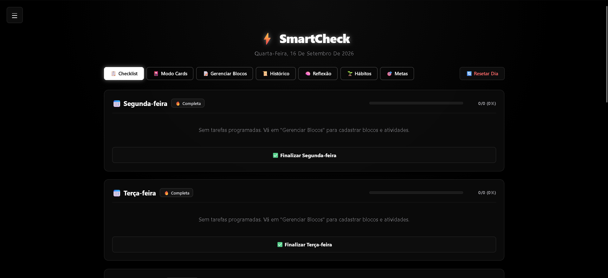
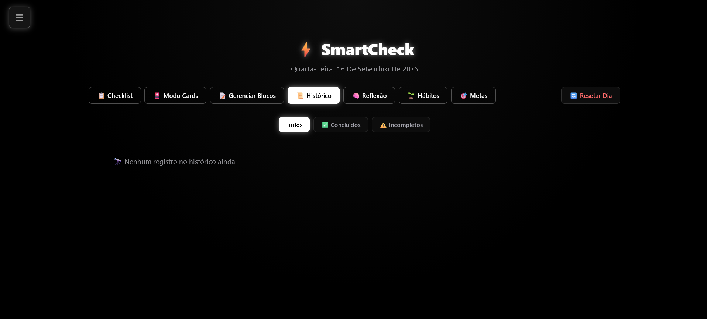
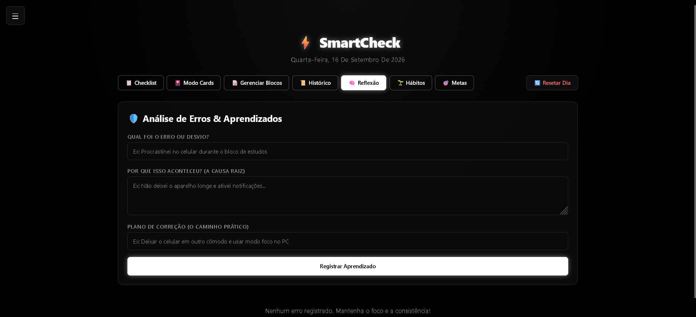
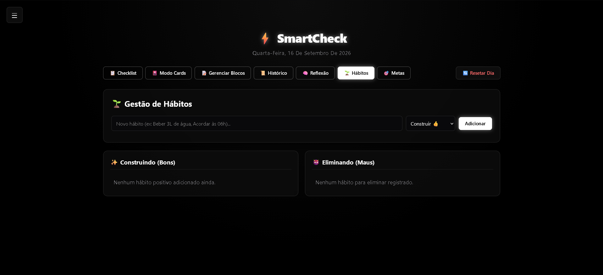
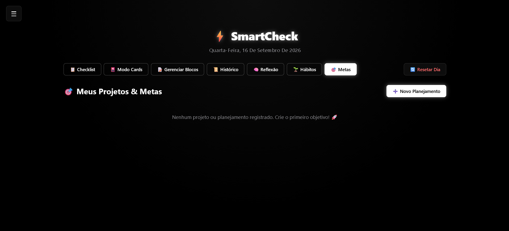
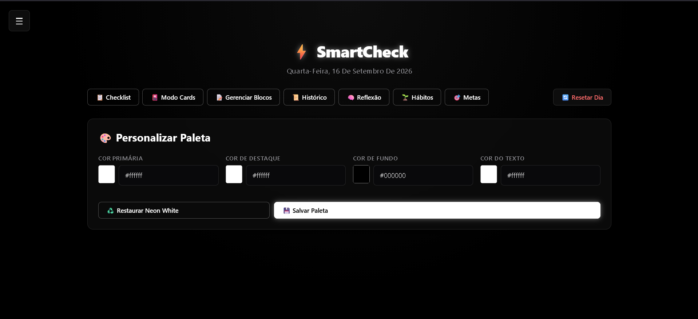
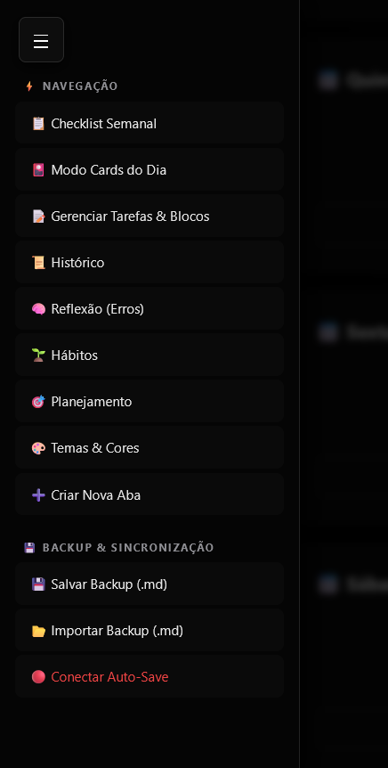

🚀 Demo online:
[https://senhor-white.github.io/Um-simples-checklist/](https://senhor-white.github.io/Um-simples-checklist/)

💾 Os dados são salvos no navegador (localStorage).

## Teste rápido (1 minuto)

1. Abra o link da demo
2. Crie 2 tarefas no checklist
3. Marque uma como concluída
4. Finalize o dia
5. Recarregue a página e veja o histórico

---

🚀 Guia de Uso: SmartCheck - Painel de Evolução
O SmartCheck é a sua ferramenta completa para produtividade, gestão de hábitos e autoconhecimento. Este guia explica cada funcionalidade para você tirar o melhor proveito do seu painel.

📋 1. Checklist Diário
O coração do sistema. Aqui você gerencia suas tarefas de cada dia da semana.

Como usar: Marque os itens conforme os conclui. A barra de progresso no topo do card mostrará sua evolução em tempo real.

Finalizar Dia: Ao completar as tarefas, clique no botão para salvar o dia no seu histórico.

Rotina Mínima: Use o ícone de folha (🍃) para dias mais leves onde você quer focar apenas no essencial.

📜 2. Histórico e Filtros
Acompanhe seu desempenho passado e veja onde você teve sucesso ou falhas.

Status: O sistema registra dias como ✅ (Completos) ou ⚠️ (Incompletos).

Justificativa: Se você não completar um dia, o sistema pedirá uma justificativa. Isso ajuda a entender padrões de falha.

Filtros: Use os botões de filtro no topo para ver apenas os dias que deseja analisar.

🧠 3. Reflexão (Análise de Erros)
Transforme falhas em aprendizado. Use esta aba sempre que algo não sair como planejado.

O Erro: Descreva o que aconteceu.

A Causa: Identifique o motivo real (ex: cansaço, distração).

O Caminho: Defina uma ação prática para que o erro não se repita.

🌱 4. Gestão de Hábitos
Dividido entre bons hábitos que você quer Construir e maus hábitos que quer Destruir.

Bons: Liste hábitos positivos (ex: Meditar, Ler).

Maus: Registre o que quer eliminar. Quando conseguir vencer um vício ou mau hábito, use o botão para "Destruí-lo" e registrar a data da vitória.

🎯 5. Planejamento de Projetos
Para objetivos de longo prazo que exigem mais do que um simples checklist.

Objetivo: Onde você quer chegar.

Plano de Ação: O passo a passo detalhado.

Visualização: Seus projetos ficam salvos em cards modernos para fácil consulta.

🎨 6. Personalização (Temas e Abas)
Deixe o painel com a sua cara.

Temas: No menu lateral, você pode alterar as cores primárias, de destaque e de fundo.

Criar Abas: Precisa de um espaço para anotações extras? Use a função "Criar Aba" para adicionar seções personalizadas ao seu menu.

💾 7. Segurança e Backup
Seus dados são salvos localmente no seu navegador, mas você pode garantir que nunca os perderá:

Salvar Backup (.md): Exporta todos os seus dados para um arquivo de texto.

Auto-Save: Conecte o sistema a um arquivo no seu computador para que ele salve automaticamente cada alteração (disponível em navegadores modernos).

💡 Dica de Ouro:

O SmartCheck funciona 100% offline. Você pode baixar o arquivo HTML e usá-lo em qualquer lugar, mesmo sem internet.

Log de Atualizações
Versão 0.2.0 – 26 de fevereiro de 2026
Funcionalidades adicionadas:

Animação de entrada
Ao carregar o arquivo HTML, é exibida uma animação simples de um símbolo de checklist que aparece rapidamente no centro da tela. Em seguida, a animação desaparece e a tela principal do checklist é carregada automaticamente.
Modo Cards por Dia
Nova funcionalidade que exibe as tarefas do dia em formato de cards, uma tarefa por vez.
Após marcar a tarefa atual como concluída, o próximo card é exibido automaticamente.
Quando todas as tarefas do dia são concluídas, é apresentado um HUD personalizado e elegante informando que os cards foram resetados, pois o dia foi finalizado.
Melhoria na interface
A interface foi refinada para ficar mais bonita, organizada, intuitiva e clean, mantendo exatamente os mesmos tons de cores utilizados no projeto original.
Organização do projeto
Os arquivos foram separados para maior clareza e manutenção:
index.html
style.css
script.js

Imagens:

Todas as funcionalidades existentes foram preservadas sem qualquer alteração.

---

Versão 0.2.1 – 16 de Novembro de 2026

📱 Correções Visuais para Dispositivos Móveis

* Ajustes de responsividade em telas pequenas e smartphones.
* Correção de alinhamento em menus, modais e elementos sobrepostos no mobile.
* Espaçamentos e áreas de toque otimizados para navegação mobile.

✨ Novo Visual

* Redesign visual refinado mantendo a identidade do projeto.
* Melhorias na hierarquia visual, tipografia e detalhes de acabamento na interface.
* Transições e efeitos visuais mais suaves durante a navegação.
---
## Novo visual do Modo Card:

---
🛠️ Correções de Funções

* Ajuste de bugs pontuais no fluxo de criação e marcação de tarefas.
* Melhorias na estabilidade da persistência dos dados no localStorage.
* Correções na sincronização dos filtros do histórico e das abas personalizadas.

⚡ Otimização

* Limpeza e refatoração do código (CSS e JS) para melhor desempenho.
* Redução no tempo de resposta das interações e carregamento mais ágil.
